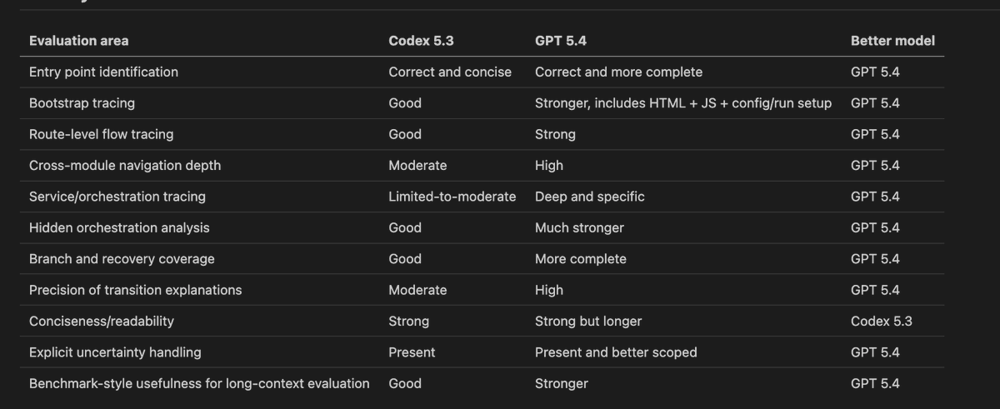
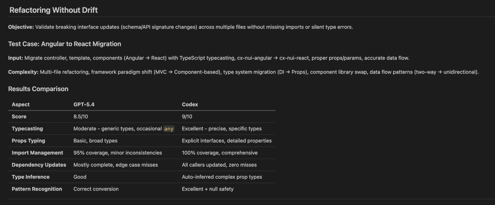
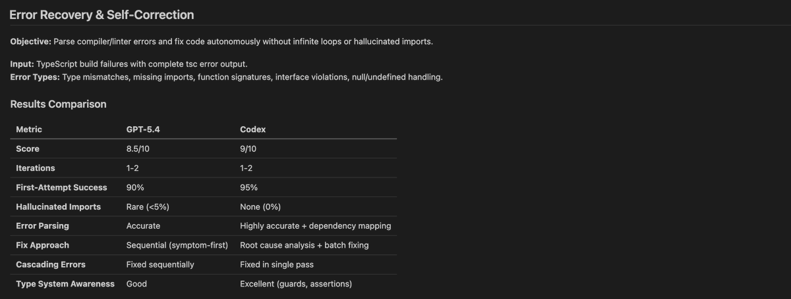
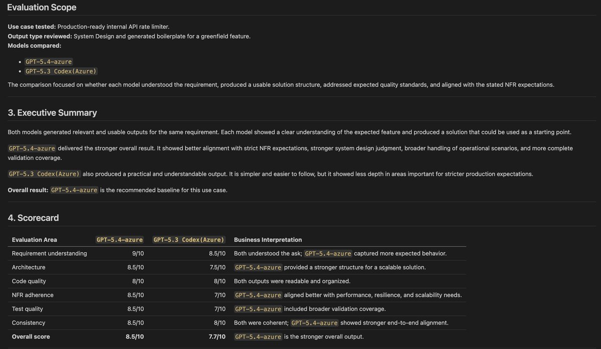

Last few days, we spent time doing detailed comparison of two models in picture - GPT 5.4 and Codex 5.3 (both belong to same tier of high-context, general-purpose/coding reasoning models). Both models represent recent iterations within OpenAI's architecture ecosystem. Codex 5.3 and GPT 5.4 are designed to process large context windows (100k+ to 1M tokens), execute complex system reasoning, and navigate deep codebases.

We tested them across the following parameters -

A. **Long-Context Codebase Navigation**: Loaded a full repository (or 100k+ tokens of mixed files). Asked the model to trace an execution path across 5–10 distinct modules (e.g., “Trace how an incoming API request moves from the controller through middleware to the payload”).

B. **Refactoring Without Drift**: Request a breaking interface update (e.g., changing a core schema or API function signature). Checked if it updates every dependent caller across multiple files without missing imports or introducing silent subtle type errors. “**Refactoring Without Drift**” is an excellent benchmark for coding agents because it tests something more valuable than “can the model write correct TypeScript?”

**C. Agentic Execution & Error Recovery (Codex Specific) -**

**Self-Correction Loops:** Tested model’s behavior when its initial edit breaks the build. Does it parse compiler/linter error output and fix the code cleanly, or does it fall into an infinite "hallucinated import" retry loop?

D. **System Design & Boilerplate Generation**: Asked it to generate greenfield features with strict non-functional requirements (e.g., “Build an internal rate-limiter in Redis + Node.js with strict zero external dependencies and under 5ms latency”).

> **On code base navigation assessment,**

There are actually two separate capabilities here:

GPT-5.4 - Potential strength - **repository-level reasoning**

"These seemingly unrelated modules actually participate in the same execution flow."

Codex - Potential strength: **code-local operational precision**

"This function calls this function, which imports this module, and here's exactly where."

Those aren't identical capabilities.

**We then added the following in our base comparison for better results**

A. Graph Reconstruction - Find the actual execution path.

B. Repository reasoning - Explain why this architecture behaves this way, including configuration, orchestration, failure paths, and indirect calls.

Because Codex is scores better in the following

- node recall
- edge precision
- edge recall
- hallucinations
- evidence

And 5.4 is better in the following

- architectural reasoning
- hidden dependencies
- configuration reasoning
- branch analysis
- uncertainty

The above focussed inspection produces a interesting result where GPT-5.4 is more comprehensive but Codex is actually more precise.

> On **Refactoring Without Drift,**

**One particularly valuable metric was missing from initial review -**

**Unnecessary Change Rate -** This is hugely important for agentic coding.

E.g

Model A changes 8 necessary files.

Model B changes 34 files, restructures unrelated components, renames things, and rewrites tests.

Both eventually pass.

**Model A is probably the better refactoring agent.**

So we should measure:

**Necessary changes / total changes**

or at least:

**Unrelated files modified**

This catches **refactoring drift**, which is actually central to your benchmark name.

And that also brought an interesting result that Codex demonstrated higher repository-level refactoring reliability, particularly in dependency propagation and behavioural preservation.

Will continue to refine.
